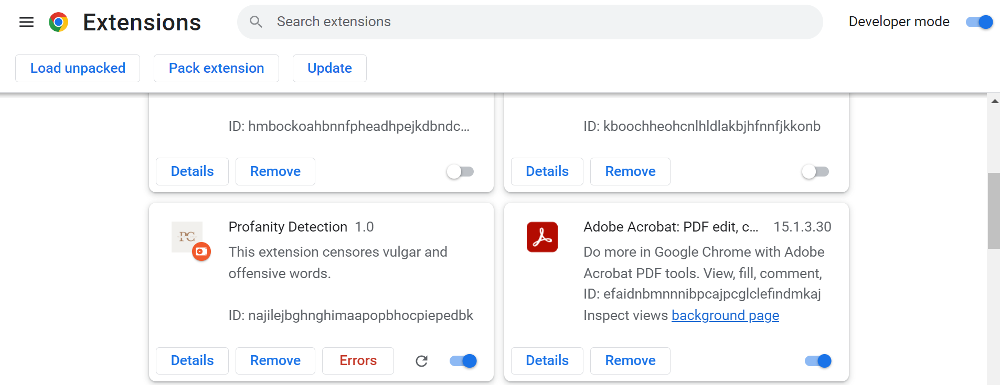
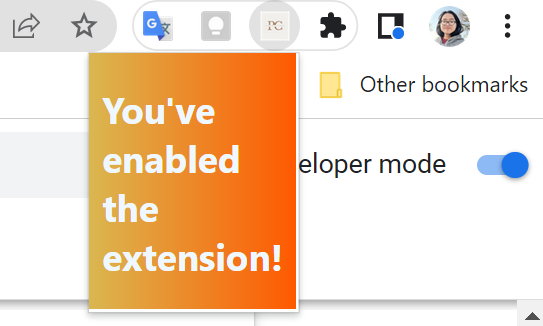
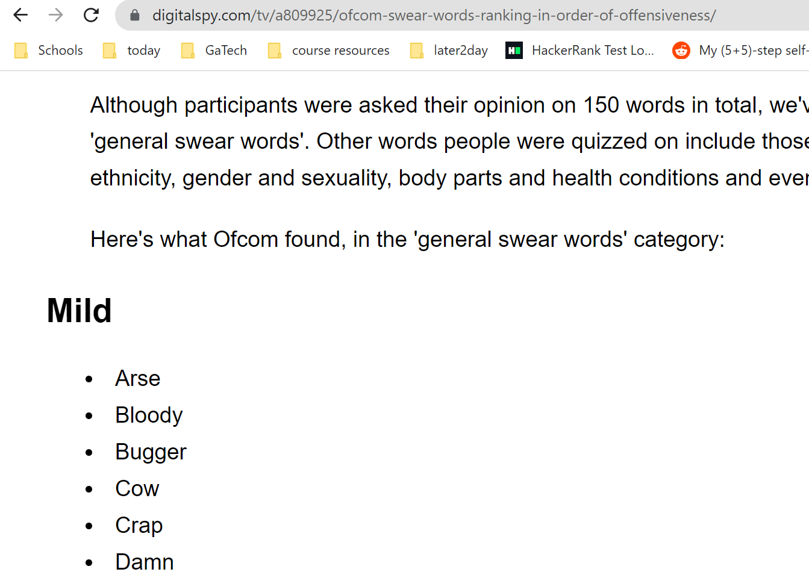
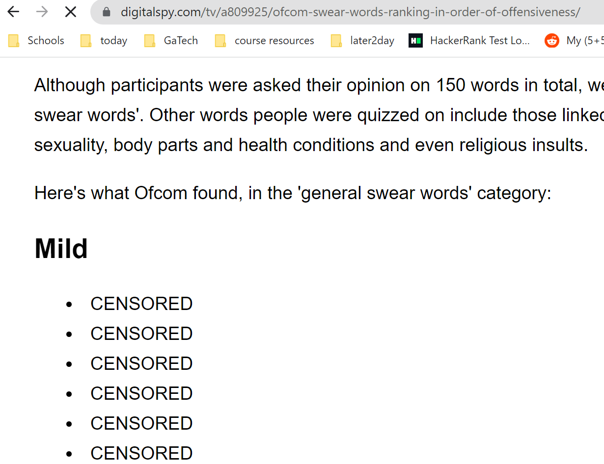

# profanity-dectection-chrome-extension
A Chrome extension that detects vulgar/offensive words and censors them.
## About
This app extension scans the webpage's content and censors any vulgar/offensive word by altering the page's source code. The add-on makes users'experience is made safer on the Internet.
## Installation
1. Clone or download this repository into a folder
2. Go to chrome://extensions/
3. Check the box "Developer mode"
4. Click "Load unpacked extension.." and select the folder
5. Run the extension
##Photos

